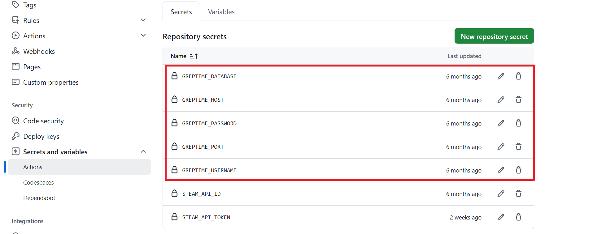
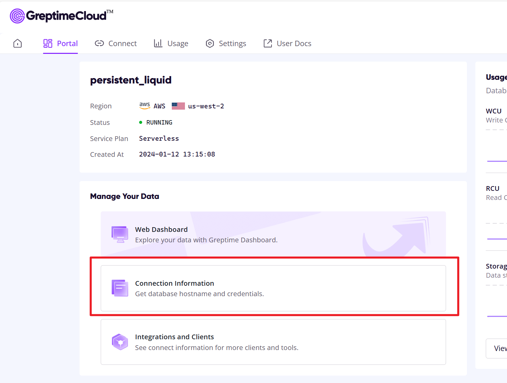
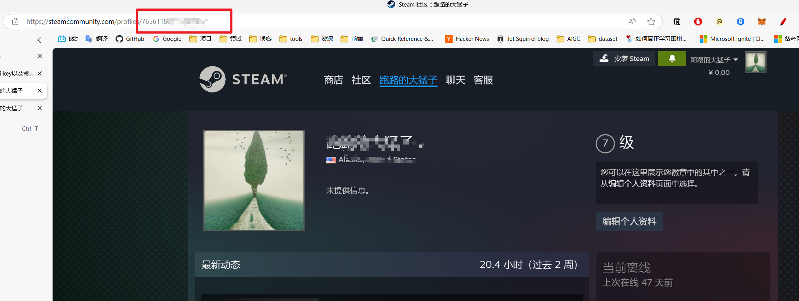
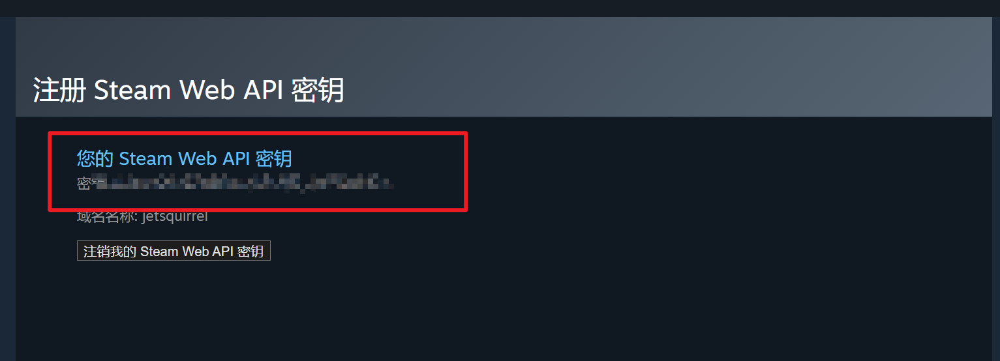
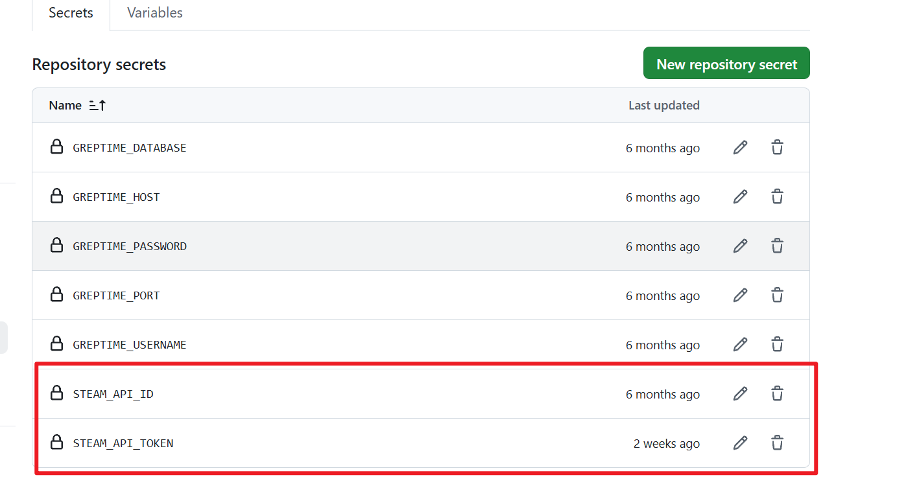
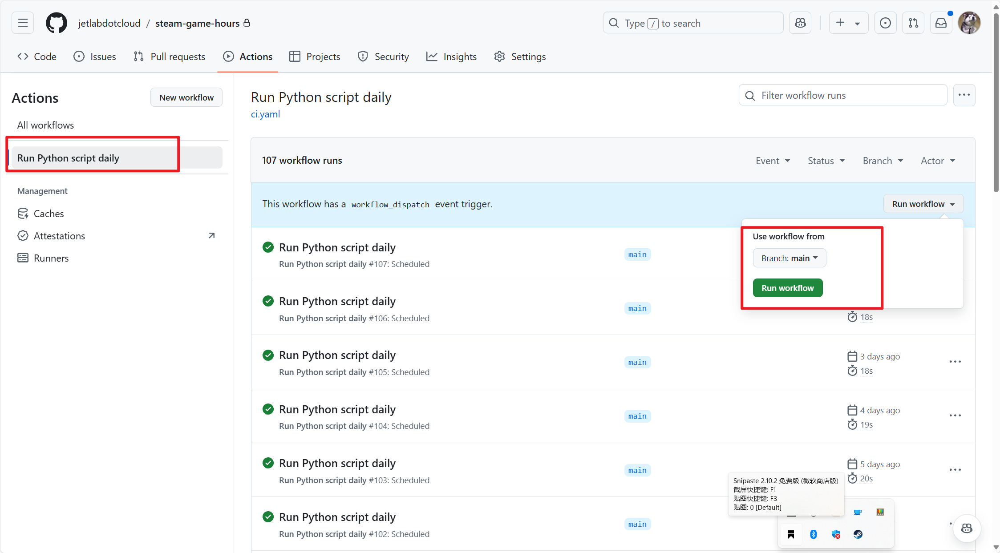

# Steam Game Hours

This project is a simple demo for tracking the hours played for a game on Steam. It uses the Steam API to get the hours played for a game and stores it in a database. 

The project using Github Actions, Python, GreptimeDB, and Grafana.

## How to run
1. Clone this to your repository

2. Create a [GreptimeDB](https://console.greptime.cloud/) account update your secets in repository settings



Run create tables:
```SQL
CREATE TABLE IF NOT EXISTS "recently_play_games" (
  "ts" TIMESTAMP(3) NOT NULL DEFAULT current_timestamp(),
  "appid" INT NULL,
  "game_name" STRING NULL,
  "playtime_2weeks" FLOAT NULL,
  "playtime_forever" FLOAT NULL,
  TIME INDEX ("ts")
)
```

3. Create steam api id(in your profile page) and [api key](https://steamcommunity.com/dev/apikey)  and update your secets in repository settings





4. you can run this in Github Actions page:


5. Link to Grafana

TODO
Reference Greptime docs
